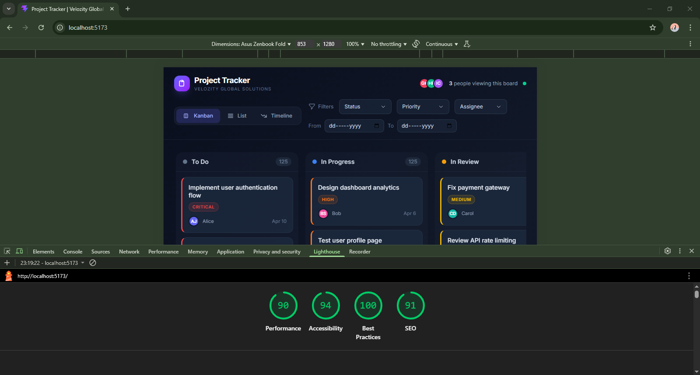

# Project Tracker — Velozity Global Solutions

**[Live Demo]**

A fully functional frontend application for project management built with **React + TypeScript**. Features Kanban, List, and Timeline views, custom drag-and-drop, and virtual scrolling for 500+ tasks — built from scratch without external UI, DnD, or virtual scrolling libraries.

---

## Setup Instructions

```bash
git clone https://github.com/vidhan-kadu/velozity-project-tracker.git
cd velozity-global-solutions
npm install
npm run dev
```

The app will be available at `http://localhost:5173`.

---

## State Management Decision

**Choice: React Context + useReducer**

I chose `React Context + useReducer` to keep the project free of external dependencies. This built-in solution is sufficient for this application's scale. `useReducer` enforces strict, predictable state transitions (updating statuses, setting views, filtering), while TypeScript integration ensures all actions are fully typed and exhaustively explicitly handled. Performance is maintained by computing derived state efficiently with `useMemo`.

---

## Virtual Scrolling Implementation

Implemented entirely from scratch in `src/hooks/useVirtualScroll.ts` without using libraries like `react-window` or `react-virtualized`. 

By establishing a fixed row height, the hook calculates exactly which rows fall within the current visible viewport range based on the container's `scrollTop`. It renders only these visible rows plus a small buffer of 5 rows above and below to prevent blank gaps during fast scrolling. A CSS `transform: translateY()` positions the rendered window of rows correctly within a container that represents the total virtual height. This allows the DOM to render only ~20 items at any time, instead of all 500+ tasks.

---

## Drag-and-Drop Approach

Built natively using browser Pointer Events (`pointerdown`, `pointermove`, `pointerup`) in `src/hooks/useDragAndDrop.ts` without libraries like `dnd-kit`.

When a drag initiates, the original card is left in the DOM but dimmed via opacity to prevent layout shifts. A cloned "ghost" element is appended to the document body and follows the cursor utilizing GPU-accelerated `transform: translate()` for smooth 60fps movement. Drop zones are manually detected in real-time by hit-testing valid columns using `getBoundingClientRect()`. Upon dropping the ghost element on a valid column, an action is dispatched to update the task status; otherwise, it snaps back to its origin.

---

## Lighthouse Performance

> Run on production build: `npm run build && npx serve dist`



---

## Technical Solution Summary

The hardest UI problem I solved was building the custom cross-column drag-and-drop system from scratch. Unlike using a library that abstracts away complexity, I had to manually handle pointer event capture, ghost element creation, positioning, drop zone hit detection, and snap-back animations. 

The drag placeholder was the most nuanced technical challenge: rather than removing the active card from the DOM (which shifts all cards below it and creates a jarring visual reflow), I kept the original card in place at 25% opacity with a grayscale filter. This creates a natural "ghost origin" that shows where the card came from while guaranteeing zero layout shift. Securing event listeners directly to the `window` object ensures the drag interaction never breaks, even if the user moves the cursor outside the viewport rapidly.

**If I had more time to refactor**, I would implement within-column reordering by calculating the insertion index based on the cursor's Y position relative to other cards' midpoints, enabling full positional drag-and-drop instead of just cross-column status changes.